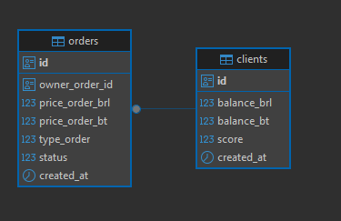

## Como rodar o projeto

1. Crie um arquivo `.env` com base no `.env-sample`.

2. Na primeira vez, execute o comando:

   ```bash
   make build
   ```

3. Se o projeto já foi compilado anteriormente, você pode apenas executar:

   ```bash
   make run
   ```

---

## Como rodar os testes unitários

Execute o comando:

```bash
make test
```

---

## Rotas e regras

###  Exemplos de requisições

Você pode copiar os comandos `curl` abaixo e colá-los em ferramentas como [Insomnia](https://insomnia.rest) ou [Postman](https://www.postman.com/) para testar as rotas com os dados já preenchidos.


### Criar poposta (Create order)

**POST** `http://localhost:8080/orders`

```bash
curl --request POST \
  --url http://localhost:8080/orders \
  --header 'Content-Type: application/json' \
  --data '{
    "owner_order_id": "aab4d348-0c67-4796-b977-9e779b29499c",
    "price_order_brl": 1500,
    "price_order_bt": 8,
    "type_order": 1,
    "status": 1
}'
```

---

### Atualizar status da proposta (Update status order)

**PATCH** `http://localhost:8080/orders/:id/status/:newStatus`

```bash
curl --request PATCH \
  --url http://localhost:8080/orders/eff91ed6-9a78-433e-aa80-d34a7507cc6d/status/4
```

---

### Listar propostas (Get all orders)

**GET** `http://localhost:8080/orders`

```bash
curl --request GET \
  --url http://localhost:8080/orders
```

---

### Consultar cliente (Get client)

**GET** `http://localhost:8080/client/:id`

```bash
curl --request GET \
  --url http://localhost:8080/client/aab4d348-0c67-4796-b977-9e779b29499c
```

---

### Usuários cadastrados para teste

Já foram cadastrados cinco usuários com saldo em reais e bitcoins. Use os seguintes IDs para consulta na rota `Get client` e realizar testes de transações:

```
b7050560-3387-4318-812d-f671ae9caa6e  
2268237d-1079-47e8-b7b2-8ab9ae1942f5  
d3909b31-045b-4c3e-a6f8-2edb54316b37  
e65d206b-aa5c-4d47-8684-672b2bc8a826  
dc333741-4adc-4e28-89a1-f0e45d38b2db  
```

---

## Regras de negócio e tomada de decisões

O sistema utiliza alguns **enums** para representar tipos e status de ordens. Veja abaixo:

### Tipos de proposta (`type_orders`)

| Código | Descrição     |
|--------|----------------|
| 1      | BUY (Compra)   |
| 2      | SELL (Venda)   |

### Status da proposta (`status`)

| Código | Descrição         |
|--------|--------------------|
| 1      | OPEN (Aberta)      |
| 2      | WAITING (Pausada)  |
| 3      | DONE (Concluída)   |
| 4      | CANCEL (Cancelada) |

---

### Regras de transição de status

- **OPEN (1)** pode ser alterado para:
  - **WAITING (2)**: proposta pausada temporariamente
  - **DONE (3)**: proposta negociada com sucesso
  - **CANCEL (4)**: encerrada manualmente sem negociação

- **WAITING (2)** pode ser alterado para:
  - **OPEN (1)**: reaberta para negociação
  - **CANCEL (4)**: encerrada manualmente

- **DONE (3)**:  
  - Não permite alteração (transação finalizada)

- **CANCEL (4)**:  
  - Não permite alteração (encerramento definitivo)

---

## Relação das tabelas no banco

